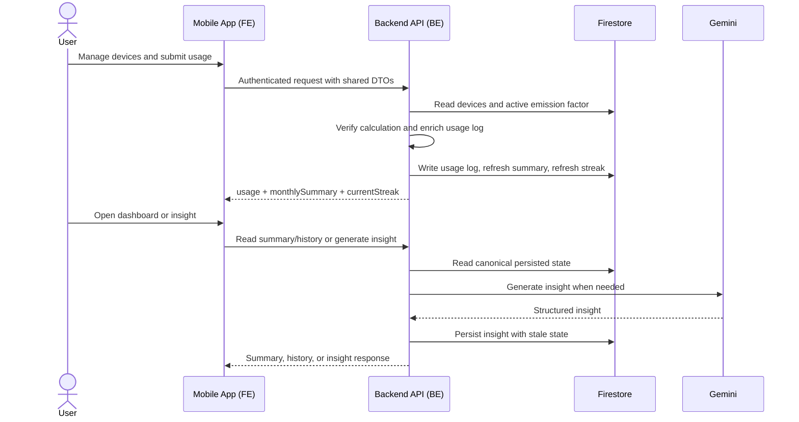
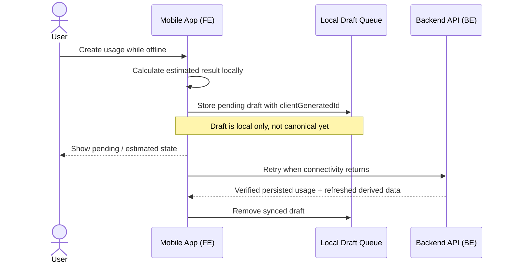

# Carbon Tracker

Carbon Tracker is a mobile-first electricity carbon tracking app. Users keep a device inventory, log electricity usage, see monthly energy and CO2e trends, and generate practical energy-saving insight.

The current MVP is electricity-only. Transport, food, waste, rewards, and marketplace features are out of scope.

The source of truth for product behavior is [docs/PRD.md](docs/PRD.md). The source of truth for engineering vocabulary and boundaries is [CONTEXT-MAP.md](CONTEXT-MAP.md) plus the context docs in each app/package.

## Product Overview

### What the app does

- lets a user sign in with Firebase Auth
- lets a user manage a personal device inventory
- lets a user log electricity usage through `device_breakdown`, direct `kwh`, or `meter_reading`
- shows instant estimated results on mobile
- sends canonical usage logs to backend for verified calculation and persistence
- recalculates monthly summary and current streak on usage-log changes
- generates backend-owned Gemini insight for full-account users
- supports offline create through a local draft queue

### Current product model

The repo has moved away from the older root-collection mobile model.

Current canonical model:

- `Device` is backend-owned inventory under `users/{userId}/devices/{deviceId}`
- `Usage Log` is the canonical electricity tracking record
- `device_breakdown` is the preferred mobile input path
- monthly summary and current streak are backend-derived
- insight is backend-generated and may be returned with `isStale`
- mobile writes directly to Firestore only for `users/{userId}/preferences/main`

## User Flow

### Primary flow

```text
Create or update device inventory
-> Log electricity usage
-> Mobile shows instant estimated result
-> Backend verifies and stores canonical usage log
-> Backend refreshes monthly summary and current streak
-> User views dashboard/history
-> Full-account user generates or reads insight
```

### Online interaction diagram



### Offline create flow



## Architecture

### Monorepo layout

- [`apps/mobile`](apps/mobile): Expo client, auth flow, device UX, history/dashboard screens, offline draft handling
- [`apps/api`](apps/api): Hono API, verified calculation, device CRUD, usage CRUD, monthly summary, streak, insight generation
- [`packages/shared`](packages/shared): shared backend-mobile API contracts

Use [CONTEXT-MAP.md](CONTEXT-MAP.md) to decide which context doc to read first.

### Context docs

- Mobile: [apps/mobile/CONTEXT.md](apps/mobile/CONTEXT.md)
- Backend: [apps/api/CONTEXT.md](apps/api/CONTEXT.md)
- Shared contracts: [packages/shared/CONTEXT.md](packages/shared/CONTEXT.md)

### Data authority

Backend-owned:

- verified calculation fields
- device inventory CRUD
- canonical usage logs
- monthly summaries
- current streak
- insights
- emission factor reads

Mobile-owned:

- form state
- local estimated preview
- offline draft queue
- `preferences/main` Firestore document

## Current API Surface

Implemented or expected MVP routes under `/v1`:

- `GET /health`
- `GET /emission-factors`
- `POST /calculate-electricity`
- `GET /devices`
- `POST /devices`
- `PATCH /devices/:deviceId`
- `DELETE /devices/:deviceId`
- `GET /electricity-usages?month=YYYY-MM`
- `POST /electricity-usages`
- `PATCH /electricity-usages/:usageId`
- `DELETE /electricity-usages/:usageId`
- `GET /monthly-summary?month=YYYY-MM`
- `POST /recalculate-monthly-summary`
- `POST /generate-energy-insight`

All user-specific routes require Firebase ID token authentication.

## Canonical Data Model

### Key entities

- `Device`: backend-owned appliance inventory item
- `Usage Log`: canonical tracked electricity record for one `usageDate`
- `Monthly Summary`: backend-derived aggregate for one `YYYY-MM`
- `Current Streak`: backend-derived consecutive tracked-day count
- `Insight`: backend-generated monthly advice document with `isStale`

### Important rules

- one usage log belongs to exactly one `usageDate`
- a user may have multiple usage logs on the same day
- `device_breakdown` request items send only `deviceId` and `durationMinutes`
- backend enriches breakdown snapshots and derives kWh and emissions
- deleting a device does not rewrite historical usage logs
- persisted usage edit/delete is online-only
- unsynced drafts may be edited locally before upload
- guest users can manage devices and usage logs
- insight remains full-account-only

## Getting Started

### Prerequisites

- `pnpm`
- `node`
- Firebase project access
- Google Cloud credentials for backend work

Optional but commonly needed:

- `firebase` CLI
- `gcloud` CLI

### Install dependencies

From repo root:

```bash
pnpm install
```

### Environment files

- mobile template: [apps/mobile/.env.example](apps/mobile/.env.example)
- backend template: [apps/api/.env.example](apps/api/.env.example)

Read the full Firebase and local environment setup in [docs/firebase-setup.md](docs/firebase-setup.md).

### Run backend locally

```bash
pnpm --filter api dev
```

### Run mobile locally

```bash
pnpm --filter mobile dev
```

The mobile app reads `EXPO_PUBLIC_API_BASE_URL` from env. Use the platform-appropriate local URL documented in [docs/firebase-setup.md](docs/firebase-setup.md).

## Developer Guide

### Read this first

Before changing code, read:

- [AGENTS.md](AGENTS.md)
- [CONTEXT-MAP.md](CONTEXT-MAP.md)
- [docs/PRD.md](docs/PRD.md)
- [docs/firebase-setup.md](docs/firebase-setup.md)

Then read the context doc for the area you are touching.

### How to approach changes

1. Start from product language in the PRD and context docs.
2. If a change spans FE and BE, update `packages/shared` contracts first.
3. Treat backend as the authority for canonical tracking state.
4. Avoid introducing new legacy root-collection behavior.
5. Preserve offline create behavior where required.

### Common commands

From repo root:

```bash
pnpm build
pnpm typecheck
pnpm test
pnpm --filter api test
pnpm --filter mobile dev
pnpm --filter api dev
```

### Testing

Use the smoke-test guide for end-to-end validation:

- [docs/smoke-testing-guide.md](docs/smoke-testing-guide.md)

That guide covers:

- your own local FE + backend setup
- a remote teammate setup using a shared reachable backend
- device CRUD
- usage create/update/delete checks
- summary/streak refresh
- insight auth policy
- offline queue behavior

### Current caveat

Manual smoke testing is still important because the mobile app has pre-existing dependency/type issues unrelated to the migration work. Do not treat mobile behavior as verified only from API tests.

## Documentation Index

- Product requirements: [docs/PRD.md](docs/PRD.md)
- Context routing: [CONTEXT-MAP.md](CONTEXT-MAP.md)
- Firebase setup: [docs/firebase-setup.md](docs/firebase-setup.md)
- Smoke testing: [docs/smoke-testing-guide.md](docs/smoke-testing-guide.md)
- Migration plan: [docs/mobile-backend-migration-plan.md](docs/mobile-backend-migration-plan.md)
- ADRs: [docs/adr](docs/adr)
- Agent workflow: [docs/AGENTIC-WORKFLOW.md](docs/AGENTIC-WORKFLOW.md)

## Status

This repo is in an active migration from legacy mobile-owned electricity data flows to backend-owned canonical tracking.

If you see a mismatch between code and older documentation, trust these documents in this order:

1. [docs/PRD.md](docs/PRD.md)
2. relevant `CONTEXT.md`
3. active ADRs in [docs/adr](docs/adr)
4. current shared contracts in [packages/shared/src/index.ts](packages/shared/src/index.ts)
