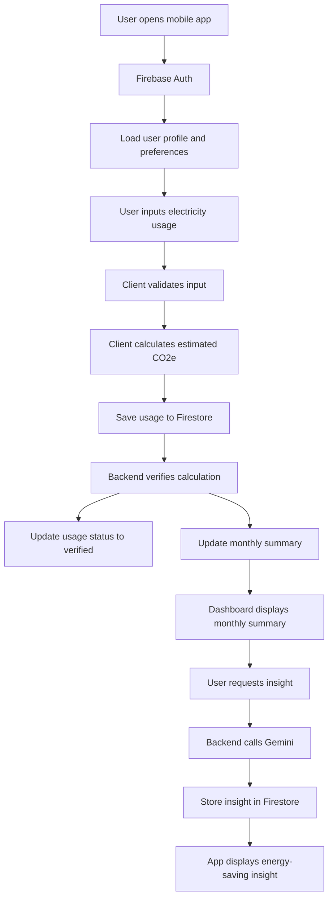
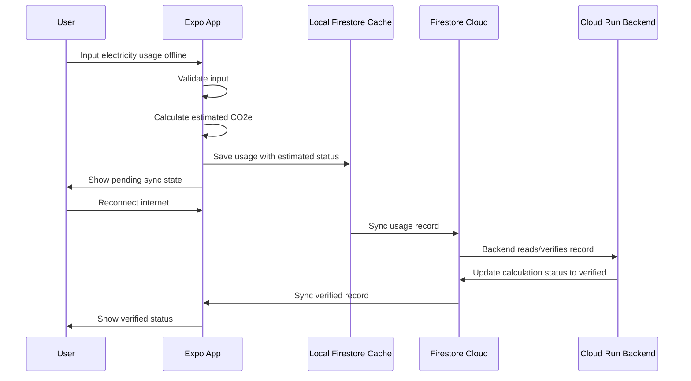

# Carbon Footprint Tracker Mobile App — Product Requirements Document

## 1. Metadata

| Field | Value |
|---|---|
| Document ID | PRD-CFT-ENERGY-001 |
| Product Name | Carbon Footprint Tracker Mobile App |
| Sprint Scope | Electricity / Energy Usage Tracking |
| Status | Draft |
| Target Platform | Mobile, cross-platform via Expo |
| Target Users | Household users who want to understand and reduce electricity-related carbon emissions |
| Team Roles | PM, UI/UX Designer, Frontend/Mobile Engineer, Backend Engineer |
| Frontend Stack | Expo, React Native, TypeScript |
| Backend Stack | Hono + TypeScript, Firebase Admin SDK, Cloud Run |
| Database | Firestore |
| Auth | Firebase Auth |
| AI Integration | Gemini via Backend |
| Deployment | Google Cloud Run |
| Current Sprint Exclusions | Transport emissions, food waste emissions, carbon offset marketplace, complex billing tariff engine |

---

## 2. Executive Summary

### 2.1 Problem Statement

Users who care about environmental impact often do not know how much carbon emission is produced by their household electricity usage. Electricity bills and kWh numbers are not immediately meaningful to most users, and manual CO₂e calculation is too technical for everyday use.

This product helps users convert electricity usage into understandable carbon footprint metrics, track their usage history, view monthly summaries, and receive practical energy-saving suggestions powered by Gemini.

### 2.2 What

A mobile app that allows users to:

```txt
- Log electricity usage manually
- Calculate estimated carbon emissions from electricity usage
- Store usage history
- View monthly energy emission summaries
- Receive AI-generated energy saving insights
- Continue logging data while offline
```

### 2.3 Why

Users need a simple way to understand the environmental impact of electricity consumption. By showing kWh usage as estimated kg CO₂e and giving actionable suggestions, the app helps users build awareness and improve household energy habits.

### 2.4 Who

Primary users:

```txt
- Students or young adults living in homes, apartments, dorms, or rented rooms
- Eco-conscious users who want to reduce energy consumption
- Household users who want a simple monthly electricity carbon tracker
```

Secondary users:

```txt
- Hackathon judges evaluating impact, feasibility, AI integration, and technical implementation
- Developers and AI agents maintaining or extending the product
```

---

## 3. High-Level Product Approach

### 3.1 Solution Summary

The app focuses on **electricity usage only** for the current sprint.

Users input electricity usage in kWh or meter reading. The system calculates estimated carbon emissions using an emission factor stored in Firestore. The result is saved as a usage record. A monthly summary is generated for dashboard visualization. Gemini provides contextual suggestions based on user preferences and energy usage history.

### 3.2 Core Flow

```txt
User logs electricity usage
→ App calculates instant estimated CO₂e
→ Usage record is stored in Firestore
→ Backend verifies calculation
→ Monthly summary is updated
→ User views dashboard
→ User requests or receives Gemini-powered insight
```

### 3.3 Offline-First Approach

The mobile app should allow users to log electricity usage while offline.

When offline:

```txt
- User can create electricity usage logs
- Client calculates estimated CO₂e locally
- Data is stored in local Firestore cache
- UI marks the record as estimated / pending sync
```

When online:

```txt
- Firestore syncs the pending write
- Backend verifies or recalculates the result
- Record status changes from estimated to verified
- Monthly summary and insights can be updated
```

---

## 4. Goals, Success Criteria, and Non-Goals

### 4.1 Product Goals

| ID | Goal |
|---|---|
| G-01 | Enable users to manually log electricity usage in kWh |
| G-02 | Convert electricity usage into estimated kg CO₂e |
| G-03 | Store and display electricity usage history |
| G-04 | Show monthly electricity emission summary |
| G-05 | Generate practical energy-saving insight using Gemini |
| G-06 | Support offline logging on mobile client |
| G-07 | Use Google ecosystem components where possible |

### 4.2 Success Criteria

The MVP is considered successful if:

```txt
- User can sign in
- User can input electricity usage manually
- App calculates estimated kg CO₂e
- User can save usage data
- User can view usage history
- User can view monthly summary
- User can generate or view Gemini-powered energy-saving insight
- User can create a log while offline and sync later
- Backend is deployed to Cloud Run
- Firestore stores data with clear user ownership
```

### 4.3 Non-Goals

The following are explicitly out of scope for the current sprint:

```txt
- Transport carbon tracking
- Food waste carbon tracking
- Carbon offset purchase
- Marketplace features
- Leaderboard
- Rewards or badges
- Complex electricity tariff calculation
- PLN API integration
- OCR bill scanning, unless there is extra time
- Multi-household management
- Admin dashboard
- Full carbon accounting compliance
```

---

## 5. System Scope and Boundaries

### 5.1 In Scope

```txt
Manual electricity usage logging
kWh-based carbon calculation
Meter reading input support
Emission factor storage
User preferences
Monthly summaries
AI-generated electricity-saving insights
Offline-first logging
Firebase Auth
Firestore data storage
Backend API deployed on Cloud Run
```

### 5.2 Out of Scope

```txt
Transportation emissions
Food emissions
Waste emissions
Water usage
Carbon credit purchase
Social sharing
Government-grade carbon reporting
Exact PLN billing reconstruction
Real-time smart meter integration
```

### 5.3 Technical Constraints

```txt
Frontend must use Expo / React Native
Backend must be deployable to Google Cloud Run
Database must use Firestore
Authentication should use Firebase Auth
Gemini API calls must happen on backend, not directly from client
Emission factors must not be hardcoded permanently in client
Client must support offline usage logging
```

---

## 6. Target Personas

### 6.1 Persona 1 — Eco-Conscious Student

| Attribute | Description |
|---|---|
| Name | Student User |
| Context | Lives in a rented room, dorm, or family home |
| Need | Wants to understand electricity impact without doing manual calculation |
| Pain Point | Does not know what kWh means in carbon emission terms |
| Expected Behavior | Logs monthly electricity usage and checks dashboard |

### 6.2 Persona 2 — Practical Household User

| Attribute | Description |
|---|---|
| Name | Household User |
| Context | Wants to monitor household electricity habits |
| Need | Wants simple suggestions to reduce energy usage |
| Pain Point | Electricity bills are hard to interpret |
| Expected Behavior | Inputs monthly usage and reads energy-saving insight |

### 6.3 Persona 3 — Hackathon Judge

| Attribute | Description |
|---|---|
| Name | Evaluator |
| Context | Reviews product demo, technical architecture, and impact |
| Need | Wants to see clear problem-solution fit, working MVP, AI usage, and technical feasibility |
| Pain Point | Many hackathon projects overpromise but do not work |
| Expected Behavior | Evaluates whether the app has meaningful impact and working implementation |

---

## 7. Critical User Journeys

### CUJ-01 — User Onboarding

```txt
User opens app
→ User signs in with Firebase Auth
→ App creates or loads user profile
→ User fills basic preferences
→ App routes user to dashboard
```

Success condition:

```txt
User has authenticated account and preference document is available.
```

---

### CUJ-02 — Manual kWh Logging

```txt
User opens Add Usage screen
→ User selects input type: kWh
→ User enters electricity usage amount
→ App calculates estimated kg CO₂e
→ User saves the record
→ Record appears in history
→ Monthly summary updates
```

Success condition:

```txt
User can store electricity usage and see calculated emission result.
```

---

### CUJ-03 — Meter Reading Logging

```txt
User opens Add Usage screen
→ User selects input type: meter reading
→ User enters meterStart and meterEnd
→ App calculates kWh = meterEnd - meterStart
→ App calculates estimated kg CO₂e
→ User saves the record
```

Success condition:

```txt
System correctly derives kWh from meter reading and stores valid result.
```

---

### CUJ-04 — Dashboard Summary

```txt
User opens Dashboard
→ App fetches current monthly summary
→ App displays total kWh
→ App displays total kg CO₂e
→ App displays target status
→ App displays latest insight if available
```

Success condition:

```txt
User can understand their current month electricity carbon footprint.
```

---

### CUJ-05 — Generate Energy Insight

```txt
User opens Insight screen
→ User taps Generate Insight
→ Backend reads user usage data and preferences
→ Backend calls Gemini
→ Backend stores generated insight in Firestore
→ App displays insight summary and suggestions
```

Success condition:

```txt
User receives practical energy-saving advice based on their electricity data.
```

---

### CUJ-06 — Offline Logging

```txt
User loses internet connection
→ User opens Add Usage screen
→ User inputs electricity usage
→ App calculates estimated kg CO₂e locally
→ App saves usage record locally
→ UI shows estimated / pending sync state
→ User reconnects to internet
→ Firestore syncs data
→ Backend verifies calculation
→ UI updates status to verified
```

Success condition:

```txt
User can still log electricity usage without internet connection.
```

---

## 8. Functional Requirements

### 8.1 Requirements Table

| ID | User Story | Acceptance Criteria | Priority | Owner | Status |
|---|---|---|---|---|---|
| FR-01 | As a user, I want to sign in, so that my electricity usage data is stored under my account. | Given user opens the app, when user signs in successfully, then system creates or loads `users/{userId}`. | P0 | FE/BE | Open |
| FR-02 | As a user, I want to set basic preferences, so that the app can personalize calculation and insights. | Given user is authenticated, when user saves preferences, then data is stored in `users/{userId}/preferences/main`. | P0 | FE | Open |
| FR-03 | As a user, I want to log electricity usage in kWh, so that I can track my carbon footprint. | Given user enters a positive kWh value, when user taps save, then the system calculates estimated CO₂e and stores the usage record. | P0 | FE/BE | Open |
| FR-04 | As a user, I want to log electricity usage using meter readings, so that I can calculate usage from meter difference. | Given `meterEnd >= meterStart`, when user saves the record, then system calculates `electricityKwh = meterEnd - meterStart`. | P0 | FE/BE | Open |
| FR-05 | As a user, I want to see calculated kg CO₂e, so that I understand my electricity impact. | Given valid usage input, when calculation runs, then result is shown with 2 decimal precision. | P0 | FE/BE | Open |
| FR-06 | As a user, I want to view usage history, so that I can review past electricity logs. | Given user has usage records, when user opens History, then app displays records sorted by usage date. | P0 | FE | Open |
| FR-07 | As a user, I want to view monthly summary, so that I can understand my overall energy footprint. | Given user has usage records for a month, when user opens Dashboard, then app displays total kWh and total kg CO₂e. | P0 | FE/BE | Open |
| FR-08 | As a user, I want AI-generated suggestions, so that I know how to reduce electricity emissions. | Given user has usage data, when insight is generated, then Gemini returns summary and suggestions saved in Firestore. | P0 | BE | Open |
| FR-09 | As a user, I want to log electricity usage offline, so that I can keep tracking without internet. | Given user is offline, when user saves a valid usage record, then the app stores it locally and syncs later. | P0 | FE | Open |
| FR-10 | As a backend system, I want to verify client calculations, so that stored results are consistent. | Given usage data is received, when backend recalculates it, then calculation status is updated to `verified`. | P1 | BE | Open |
| FR-11 | As a user, I want to know whether a record is estimated or verified, so that I understand sync state. | Given a usage record exists, when app renders it, then UI displays estimated, verified, or error status. | P1 | FE | Open |
| FR-12 | As a system, I want emission factors to be updateable, so that calculations are not permanently hardcoded. | Given active emission factor exists, when calculation runs, then system uses active factor from Firestore/backend. | P0 | BE | Open |

---

## 9. Gherkin Acceptance Criteria

### FR-03 — Manual kWh Logging

```gherkin
Feature: Manual electricity usage logging

Scenario: User logs valid kWh usage
  Given the user is authenticated
  And the user is on the Add Usage screen
  When the user enters 120 as kWh
  And the user taps Save
  Then the app calculates estimated CO2e
  And the app stores the usage record under the user's Firestore document
  And the usage record appears in History
```

```gherkin
Scenario: User enters invalid kWh usage
  Given the user is on the Add Usage screen
  When the user enters -10 as kWh
  Then the app shows a validation error
  And the app does not save the usage record
```

---

### FR-04 — Meter Reading Logging

```gherkin
Feature: Meter reading usage logging

Scenario: User logs valid meter reading
  Given the user is authenticated
  And the user selects meter reading input
  When the user enters meterStart as 1000
  And the user enters meterEnd as 1120
  Then the system calculates electricityKwh as 120
  And the system calculates estimated CO2e
```

```gherkin
Scenario: User enters invalid meter reading
  Given the user selects meter reading input
  When the user enters meterStart as 1200
  And the user enters meterEnd as 1000
  Then the app shows an error
  And the record cannot be saved
```

---

### FR-08 — Gemini Insight Generation

```gherkin
Feature: AI energy insight

Scenario: User generates monthly insight
  Given the user is authenticated
  And the user has at least one electricity usage record for the selected month
  When the user taps Generate Insight
  Then the backend reads the user's monthly usage data
  And the backend calls Gemini
  And the backend stores the generated insight in Firestore
  And the app displays the insight to the user
```

---

### FR-09 — Offline Logging

```gherkin
Feature: Offline electricity logging

Scenario: User logs usage while offline
  Given the user has previously authenticated
  And the device is offline
  When the user enters valid electricity usage
  And the user taps Save
  Then the app stores the record locally
  And the app marks the calculation status as estimated
  And the app marks the record as pending sync
```

```gherkin
Scenario: Offline record syncs after reconnecting
  Given the user created a usage record offline
  When the device reconnects to the internet
  Then Firestore syncs the record
  And backend verifies the calculation
  And the record status becomes verified
```

---

## 10. Non-Functional Requirements

| ID | Requirement | Target |
|---|---|---|
| NFR-01 | Calculation precision | CO₂e result must be rounded to 2 decimal places in UI |
| NFR-02 | App responsiveness | Manual calculation should appear in under 500ms on client |
| NFR-03 | Backend response time | `/calculate-electricity` should respond in under 2 seconds under normal conditions |
| NFR-04 | Offline support | User must be able to create electricity usage logs while offline |
| NFR-05 | Security | User can only access their own data |
| NFR-06 | AI security | Gemini API key must not be exposed to mobile client |
| NFR-07 | Data integrity | Backend should verify or recalculate client-provided carbon result |
| NFR-08 | Maintainability | Emission factors must be updateable without mobile app redeploy |
| NFR-09 | Error handling | Invalid input must not create valid usage record |
| NFR-10 | Privacy | Do not expose user email, usage data, or preferences to other users |

---

## 11. Data Model Requirements

### 11.1 Firestore Collections

```txt
users/{userId}

users/{userId}/preferences/main (Watt x Jam / 1000) x Faktor Emisi Indonesia (0.852 kg CO2e/kWh).

users/{userId}/electricity_usages/{usageId}

users/{userId}/monthly_summaries/{yyyy-mm}

users/{userId}/insights/{insightId}

emission_factors/{factorId}
```

---

### 11.2 `users/{userId}`

```json
{
  "displayName": "Riq",
  "email": "user@example.com",
  "photoURL": "https://example.com/avatar.png",
  "createdAt": "serverTimestamp",
  "updatedAt": "serverTimestamp"
}
```

---

### 11.3 `users/{userId}/preferences/main`

```json
{
  "country": "ID",
  "region": "Lampung",
  "householdSize": 4,
  "monthlyElectricityBudgetKwh": 150,
  "monthlyEmissionTargetKgCo2e": 120,
  "insightTone": "practical",
  "updatedAt": "serverTimestamp"
}
```

---

### 11.4 `users/{userId}/electricity_usages/{usageId}`

```json
{
  "inputType": "kwh",
  "period": {
    "startDate": "2026-05-01",
    "endDate": "2026-05-31",
    "month": "2026-05"
  },
  "input": {
    "kwh": 120,
    "meterStart": null,
    "meterEnd": null,
    "unit": "kwh"
  },
  "calculation": {
    "electricityKwh": 120,
    "emissionFactorId": "id_pln_grid_v1",
    "emissionFactorKgCo2ePerKwh": 0.85,
    "totalKgCo2e": 102,
    "method": "client_estimate",
    "status": "estimated"
  },
  "source": {
    "createdFrom": "mobile",
    "offlineCreated": false,
    "clientGeneratedId": "01HYEXAMPLE"
  },
  "timestamps": {
    "usageDate": "2026-05-31",
    "createdAtClient": "2026-05-23T10:30:00+07:00",
    "createdAtServer": "serverTimestamp",
    "updatedAt": "serverTimestamp",
    "syncedAt": "serverTimestamp"
  }
}
```

---

### 11.5 `users/{userId}/monthly_summaries/{yyyy-mm}`

```json
{
  "month": "2026-05",
  "totalKwh": 120,
  "totalKgCo2e": 102,
  "averageKwhPerDay": 3.87,
  "averageKgCo2ePerDay": 3.29,
  "usageCount": 1,
  "targetKgCo2e": 120,
  "targetStatus": "under_target",
  "updatedAt": "serverTimestamp"
}
```

---

### 11.6 `users/{userId}/insights/{insightId}`

```json
{
  "type": "monthly_energy_advice",
  "period": {
    "startDate": "2026-05-01",
    "endDate": "2026-05-31",
    "month": "2026-05"
  },
  "title": "Pemakaian listrik bulan ini masih terkendali",
  "summary": "Pemakaian listrik kamu berada di bawah target bulanan.",
  "suggestions": [
    {
      "title": "Kurangi standby power",
      "description": "Cabut charger dan perangkat elektronik yang tidak digunakan.",
      "estimatedImpactKgCo2e": 3.5
    }
  ],
  "metrics": {
    "totalKwh": 120,
    "totalKgCo2e": 102,
    "comparedToPreviousPeriodPercent": -6.5,
    "projectedMonthlyKgCo2e": 108
  },
  "model": {
    "provider": "google",
    "name": "gemini",
    "promptVersion": "energy-insight-v1"
  },
  "basedOnUsageIds": ["usage_001"],
  "createdAt": "serverTimestamp"
}
```

---

### 11.7 `emission_factors/{factorId}`

```json
{
  "category": "electricity",
  "country": "ID",
  "region": "national",
  "providerName": "PLN",
  "unit": "kwh",
  "kgCo2ePerKwh": 0.85,
  "source": "manual_seed",
  "version": "v1",
  "active": true,
  "validFrom": "2026-01-01",
  "validTo": null,
  "updatedAt": "serverTimestamp"
}
```

---

## 12. API Requirements

### 12.1 Backend API Overview

Base service:

```txt
Cloud Run service running Hono or Express.
```

Minimum endpoints:

```txt
GET  /health
GET  /emission-factors
POST /calculate-electricity
POST /generate-energy-insight
POST /recalculate-monthly-summary
```

---

### 12.2 `GET /health`

Purpose:

```txt
Validate backend service availability.
```

Response:

```json
{
  "status": "ok",
  "service": "carbon-tracker-backend"
}
```

---

### 12.3 `GET /emission-factors`

Purpose:

```txt
Return active electricity emission factors.
```

Response:

```json
{
  "data": [
    {
      "id": "id_pln_grid_v1",
      "country": "ID",
      "region": "national",
      "unit": "kwh",
      "kgCo2ePerKwh": 0.85,
      "version": "v1",
      "active": true
    }
  ]
}
```

---

### 12.4 `POST /calculate-electricity`

Purpose:

```txt
Calculate electricity usage carbon emission.
```

Request:

```json
{
  "inputType": "kwh",
  "input": {
    "kwh": 120,
    "meterStart": null,
    "meterEnd": null,
    "unit": "kwh"
  },
  "period": {
    "startDate": "2026-05-01",
    "endDate": "2026-05-31",
    "month": "2026-05"
  }
}
```

Response:

```json
{
  "electricityKwh": 120,
  "emissionFactorId": "id_pln_grid_v1",
  "emissionFactorKgCo2ePerKwh": 0.85,
  "totalKgCo2e": 102,
  "method": "server_verified",
  "status": "verified"
}
```

Validation:

```txt
inputType must be "kwh" or "meter_reading"
kWh must be greater than 0
meterEnd must be greater than or equal to meterStart
unit must be "kwh"
period.month must follow YYYY-MM format
```

---

### 12.5 `POST /generate-energy-insight`

Purpose:

```txt
Generate Gemini-powered electricity-saving insight.
```

Request:

```json
{
  "month": "2026-05"
}
```

Backend behavior:

```txt
Verify Firebase ID token
Read user preferences
Read monthly summary
Read usage records for selected month
Call Gemini
Store generated insight in Firestore
Return generated insight
```

Response:

```json
{
  "insightId": "insight_001",
  "title": "Pemakaian listrik bulan ini masih terkendali",
  "summary": "Pemakaian listrik kamu berada di bawah target bulanan.",
  "suggestions": [
    {
      "title": "Kurangi standby power",
      "description": "Cabut charger dan perangkat elektronik yang tidak digunakan.",
      "estimatedImpactKgCo2e": 3.5
    }
  ]
}
```

---

### 12.6 `POST /recalculate-monthly-summary`

Purpose:

```txt
Recompute monthly summary from electricity usage records.
```

Request:

```json
{
  "month": "2026-05"
}
```

Response:

```json
{
  "month": "2026-05",
  "totalKwh": 120,
  "totalKgCo2e": 102,
  "usageCount": 1,
  "targetStatus": "under_target"
}
```

---

## 13. Calculation Logic

### 13.1 Core Formula

```txt
totalKgCo2e = electricityKwh × emissionFactorKgCo2ePerKwh
```

Example:

```txt
electricityKwh = 120
emissionFactorKgCo2ePerKwh = 0.85

totalKgCo2e = 120 × 0.85
totalKgCo2e = 102 kg CO₂e
```

### 13.2 Meter Reading Formula

```txt
electricityKwh = meterEnd - meterStart
```

Validation:

```txt
meterEnd must be greater than or equal to meterStart
```

### 13.3 Precision

Storage:

```txt
Store calculation result as number.
```

Display:

```txt
Round to 2 decimal places in UI.
```

---

## 14. AI / Gemini Requirements

### 14.1 AI Role

Gemini is used only for generating user-facing energy-saving insights.

Gemini should not be the source of truth for:

```txt
Carbon calculation
Emission factor value
User authentication
Database validation
Security rules
```

### 14.2 Gemini Input Context

Backend should send concise context:

```json
{
  "userPreferences": {
    "region": "Lampung",
    "householdSize": 4,
    "monthlyEmissionTargetKgCo2e": 120,
    "insightTone": "practical"
  },
  "monthlySummary": {
    "month": "2026-05",
    "totalKwh": 120,
    "totalKgCo2e": 102,
    "targetStatus": "under_target"
  },
  "recentUsage": [
    {
      "date": "2026-05-31",
      "electricityKwh": 120,
      "totalKgCo2e": 102
    }
  ]
}
```

### 14.3 Gemini Output Format

Gemini output should be forced into structured JSON:

```json
{
  "title": "string",
  "summary": "string",
  "suggestions": [
    {
      "title": "string",
      "description": "string",
      "estimatedImpactKgCo2e": 0
    }
  ]
}
```

### 14.4 AI Safety Constraints

Gemini output must:

```txt
Avoid medical, legal, or financial advice
Avoid claiming exact PLN billing accuracy
Avoid inventing unsupported emission factor sources
Avoid guilt-tripping users
Avoid recommending unsafe electrical behavior
Keep suggestions practical and household-safe
```

---

## 15. Implementation Decisions

### 15.1 Frontend Decisions

| Area | Decision |
|---|---|
| Framework | Expo + React Native |
| Language | TypeScript |
| Auth | Firebase Auth |
| Data access | Firestore client SDK |
| Offline support | Firestore offline persistence |
| Local calculation | Client calculates estimated CO₂e for instant feedback |
| Status UI | Show estimated, verified, or error status |
| Navigation | Expo Router or React Navigation |
| Form validation | Zod or equivalent validation utility |

### 15.2 Backend Decisions

| Area | Decision |
|---|---|
| Runtime | Node.js |
| Framework | Hono preferred, Express acceptable if already implemented |
| Deployment | Google Cloud Run |
| Auth verification | Firebase Admin SDK |
| Database access | Firebase Admin SDK |
| AI integration | Gemini called from backend |
| Validation | Zod |
| API format | JSON REST API |
| Calculation authority | Backend provides verified calculation |

### 15.3 Database Decisions

| Area | Decision |
|---|---|
| Database | Firestore |
| User data model | User-owned subcollections |
| Usage document ID | Client-generated ID recommended |
| Monthly summary ID | `YYYY-MM` |
| Emission factor | Global read-only collection |
| Insight storage | Store generated AI output to avoid repeated Gemini calls |
| Calculation snapshot | Store factor value used at calculation time |

---

## 16. Security and Privacy Requirements

### 16.1 Authentication

```txt
All user-specific operations require Firebase Authentication.
Backend endpoints that access user data must verify Firebase ID token.
```

### 16.2 Authorization

Users may only access:

```txt
users/{ownUserId}
users/{ownUserId}/preferences/main
users/{ownUserId}/electricity_usages/*
users/{ownUserId}/monthly_summaries/*
users/{ownUserId}/insights/*
```

Users may read but not write:

```txt
emission_factors/*
```

### 16.3 Protected Writes

Client should not directly write trusted backend-only values such as:

```txt
calculation.status = verified
calculation.method = server_verified
monthly_summaries
insights
emission_factors
```

These should be written by backend/admin where possible.

### 16.4 Sensitive Data

The app should avoid collecting unnecessary sensitive data.

Do not collect:

```txt
Full address
Exact geolocation
PLN customer number unless masked
Payment details
```

---

## 17. Testing Strategy

### 17.1 Unit Testing

Backend unit tests should cover:

```txt
kWh input calculation
Meter reading calculation
Invalid negative kWh
Invalid meterEnd < meterStart
Emission factor lookup
Target status calculation
Zod validation
```

Example cases:

| Case | Input | Expected |
|---|---|---|
| kWh calculation | 120 kWh × 0.85 | 102 kg CO₂e |
| Meter reading | 1000 → 1120 | 120 kWh |
| Invalid kWh | -10 | Validation error |
| Invalid meter | 1200 → 1000 | Validation error |

---

### 17.2 Integration Testing

Test flows:

```txt
Authenticated user calls /calculate-electricity
Authenticated user calls /generate-energy-insight
Backend reads Firestore usage records
Backend writes insight document
Backend updates monthly summary
```

---

### 17.3 Frontend Testing

Test screens:

```txt
Login screen
Preferences screen
Add Usage screen
History screen
Dashboard screen
Insight screen
Offline state UI
```

Test UI behavior:

```txt
Input validation message appears
Calculation preview updates correctly
Save button disabled for invalid input
Estimated status appears before backend verification
Verified status appears after sync/verification
Empty state appears when no usage data exists
```

---

### 17.4 Offline Testing

Manual test cases:

```txt
Turn off internet
Create usage record
Confirm record appears locally
Confirm status is estimated / pending sync
Turn internet on
Confirm record syncs
Confirm backend verifies record
Confirm dashboard updates
```

---

### 17.5 AI Testing

Test Gemini output:

```txt
Output is valid JSON
Output has title, summary, and suggestions
Suggestions are relevant to electricity usage
Suggestions do not include unsafe electrical advice
Response is stored in Firestore
Repeated dashboard open does not regenerate insight unnecessarily
```

---

## 18. Analytics and Demo Metrics

For hackathon demo, track or display:

```txt
Total electricity usage this month
Total estimated kg CO₂e this month
Target status
Number of usage logs
Latest AI suggestion
Estimated reduction opportunity
Offline sync status
```

Optional internal metrics:

```txt
Number of generated insights
Number of usage logs created offline
Average backend calculation latency
```

---

## 19. UI / Screen Requirements

### 19.1 Required Screens

```txt
Authentication Screen
Onboarding / Preferences Screen
Dashboard Screen
Add Electricity Usage Screen
History Screen
Insight Screen
```

### 19.2 Dashboard Must Show

```txt
Current month total kWh
Current month total kg CO₂e
Target status
Latest insight summary
Shortcut to Add Usage
```

### 19.3 Add Usage Screen Must Support

```txt
Input type selection: kWh or meter reading
kWh field
Meter start field
Meter end field
Calculation preview
Save button
Validation error state
Offline/pending sync state
```

### 19.4 History Screen Must Show

```txt
Usage date
Input type
Electricity kWh
Estimated/verified kg CO₂e
Calculation status
Sync status
```

---

## 20. Data Flow Diagram



---

## 21. Offline Data Flow



---

## 22. Development Plan

### Phase 1 — Foundation

```txt
Set up Expo project
Set up Firebase project
Set up Firebase Auth
Set up Firestore
Set up backend project
Deploy backend health check to Cloud Run
```

### Phase 2 — Core Tracking

```txt
Implement preferences screen
Implement Add Usage screen
Implement client-side calculation
Create electricity usage documents
Create emission factor seed data
Implement /calculate-electricity
```

### Phase 3 — Dashboard and History

```txt
Implement History screen
Implement monthly summary logic
Implement Dashboard screen
Display total kWh and kg CO₂e
Display target status
```

### Phase 4 — AI Insight

```txt
Implement /generate-energy-insight
Integrate Gemini
Store insight in Firestore
Display latest insight in app
```

### Phase 5 — Offline and Polish

```txt
Test offline logging
Add status badges
Improve error states
Prepare demo data
Prepare final pitch flow
```

---

## 23. Risk Assessment

| Risk | Impact | Mitigation |
|---|---|---|
| Backend migration from Express to Hono takes too long | Feature delay | Keep Express if already stable |
| Firestore schema changes too often | FE/BE mismatch | Freeze MVP schema before implementation |
| Gemini output inconsistent | Broken UI | Force JSON output and validate response |
| Offline sync behavior confusing | Poor UX | Show estimated / pending / verified status |
| Emission factor source uncertain | Credibility issue | Use manual seed with source/version field |
| Monthly summary update logic becomes complex | Dashboard inconsistency | Recalculate summary on save or via backend endpoint |
| Too many features | MVP unfinished | Exclude transport, food, OCR, leaderboard |

---

## 24. Open Questions

| ID | Question | Owner | Decision Needed |
|---|---|---|---|
| OQ-01 | Should the MVP support only kWh input or also meter reading? | PM/FE/BE | Before Add Usage implementation |
| OQ-02 | Should insight generation be automatic or button-triggered? | PM/FE/BE | Before Insight screen |
| OQ-03 | Should monthly summary be updated by client or backend? | BE | Before Dashboard integration |
| OQ-04 | Should emission factor be seeded manually? | BE | Before calculation implementation |
| OQ-05 | Should offline records be visually marked in History? | UI/UX/FE | Before History implementation |
| OQ-06 | Should OCR bill scan be included as stretch goal? | PM | After P0 features are done |

---

## 25. AI Agent Instructions

### 25.1 General Instructions

AI agents working on this project must follow these rules:

```txt
Do not add transport tracking.
Do not add food waste tracking.
Do not add carbon offset marketplace.
Do not expose Gemini API key to client.
Do not hardcode emission factor permanently in client.
Do not store user data outside user-owned Firestore paths.
Do not generate schema changes without updating PRD and data model.
```

### 25.2 Frontend Agent Instructions

When implementing frontend:

```txt
Use Expo and TypeScript.
Use Firebase Auth for authentication.
Use Firestore SDK for user-owned data.
Support offline usage logging.
Show calculation preview before save.
Show validation errors.
Show estimated / verified / error status.
Do not call Gemini directly from client.
```

### 25.3 Backend Agent Instructions

When implementing backend:

```txt
Use Hono or Express.
Use Firebase Admin SDK.
Verify Firebase ID token for user-specific endpoints.
Validate request payloads with Zod.
Read active emission factor from Firestore.
Calculate electricity CO2e using deterministic formula.
Call Gemini only from backend.
Store generated insights in Firestore.
Return structured JSON responses.
```

### 25.4 Database Agent Instructions

When modifying schema:

```txt
Preserve user-owned subcollection structure.
Use users/{userId} as root for private user data.
Use YYYY-MM as monthly summary document ID.
Store emission factor snapshot in usage records.
Store calculation status.
Store offline source metadata.
Avoid unnecessary collections.
```

---

## 26. MVP Definition of Done

The sprint is done when:

```txt
User can authenticate.
User can set preferences.
User can input electricity usage in kWh.
User can input electricity usage via meter reading.
App calculates estimated kg CO₂e.
Usage record is saved to Firestore.
User can view usage history.
User can view monthly dashboard.
Backend can verify calculation.
Gemini can generate energy-saving insight.
Insight is stored and displayed.
Offline logging works.
Cloud Run backend is deployed.
Demo flow is stable.
```

---

## 27. Recommended Demo Script

```txt
1. Open app and sign in.
2. Show Dashboard empty state.
3. Open Add Usage.
4. Input 120 kWh.
5. Show instant CO₂e calculation.
6. Save record.
7. Open History and show saved usage.
8. Open Dashboard and show monthly summary.
9. Generate Gemini insight.
10. Show practical energy-saving suggestions.
11. Demonstrate offline logging or explain pending sync state.
12. Close with impact: user can understand and reduce electricity-related carbon footprint.
```

---

## 28. Final Scope Statement

For this sprint, the product is a focused **electricity carbon tracker**, not a full lifestyle carbon tracker.

The MVP should prioritize:

```txt
Reliable manual logging
Clear carbon calculation
Firestore-backed persistence
Offline-first mobile behavior
Useful dashboard
Gemini-powered energy insight
```

Everything outside electricity usage should be treated as future expansion.
